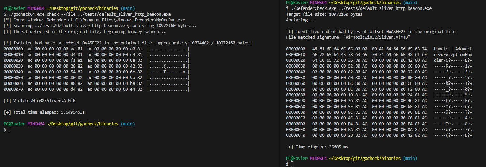

# GoCheck
GoCheck a blazingly fast™ alternative to Matterpreter's [DefenderCheck](https://github.com/matterpreter/DefenderCheck) which identifies the exact bytes that Windows Defender AV by feeding byte slices to `MpCmdRun.exe`

I also wrote a blog post showcasing this project: [Identifying Malicious Bytes in Malware](https://gatari.dev/posts/identifying-malicious-bytes-in-malware/)


## Usage
```cmd
$ gocheck check --help
Usage:
  gocheck check [flags]

Flags:
  -a, --amsi          Use AMSI to scan a file
  -d, --defender      Use Windows Defender to scan a binary
  -f, --file string   Binary to check
  -h, --help          help for check
```

## Quick Use
The `check` cobra flag is only used for ease of extensibility in the event that I finally decide to integrate [Ghidra's Headless Analyzer](https://static.grumpycoder.net/pixel/support/analyzeHeadlessREADME.html) with `gocheck`. For ease of use, you can actually completely omit the `check` flag and directly pass the file to `gocheck` as an argument.

```cmd
$ gocheck <file> /optional:args
```

> This may be changed in the future.

## Windows Defender
Real-time protection is optional when scanning using Windows Defender. If real-time protection is enabled, the file may be nuked on first scan. In order to prevent the file from being nuked on first scan, you can set an exclusion for the original file in Windows Defender as `gocheck` creates temporary copies and chucks them into C:\Temp.
```cmd
gocheck [path_to_binary] /optional: --defender
```


## AMSI
When scanning using AMSI, do ensure that real-time protection is enabled. However, at first your file may be nuked.
```cmd
gocheck [path_to_file] /optional: --amsi
```


In order to prevent the file from being nuked on first scan, you can set an exclusion for the original file in Windows Defender as `gocheck` creates temporary copies and chucks them into C:\Temp.
```ps
Add-MpPreference -ExclusionPath [path_to_folder]
```


## Both Windows Defender & AMSI
You can also scan using both Windows Defender and AMSI at the same time.
```cmd
gocheck [path_to_file] /optional: --defender --amsi
```


## Debug
Gocheck is in heavy WIP and may not work as expected. If you encounter any issues, please run the tool with `--debug` to provide more information about the issue. The `--debug` flag prints out which portions of the binary are being scanned, as well as sanity checks to ensure that the signatured portions are being correctly scanned. 
```cmd
gocheck [path_to_file] /optional: --debug
```


## Installation
You can install `gocheck` from `go install`
```bash
go install github.com/gatariee/gocheck@latest
```

Alternatively, you can download the precompiled binaries from the [releases](https://github.com/gatariee/gocheck/releases) or build it yourself.
```bash
git clone https://github.com/gatariee/gocheck
make [ windows / win64 / win32 ]
```

### Evasion Usage
You can use `gocheck` to identify bad bytes, and then pass the identified offset of bad bytes into [ghidra](https://github.com/NationalSecurityAgency/ghidra) (or, any other decompiler) to hopefully decompile the binary and locate the bad bytes in a function.

I'll be using `ghidra` to decompile the binary since I'm more familiar with it. (and, it's free)
#### 1. Check for Bad Bytes
```cmd
$ gocheck <file> /optional:args
```


* Identified bad bytes at offset **0x9DD** (from start of binary)
* 16 bytes **before & after** the bad bytes are also printed for context, but doesn't help much in this case.

#### 2. Open the binary in Ghidra
* Navigation -> Go To... -> **FILE ( 0x9DD )**
  * Alternatively, `G` also brings up the same dialog.


* The bad bytes are identified after a call to `VirtualAlloc` and before a call to `VirtualProtect` in this case, which should be easy to find in the artifact kit.


## Benchmark
> ⚠️ I am not an expert in benchmarking, and the following benchmarks are conducted on a single machine, and the results may vary on different machines. The benchmarks are conducted on a single machine to provide a rough estimate of the performance difference between `gocheck` and `DefenderCheck`.

The objective of `gocheck` was to implement a faster alternative to Matterpreter's [DefenderCheck](https://github.com/matterpreter/DefenderCheck) as I realized that it was painfully slow when scanning large binaries, which can be quite a headache for extremely large binaries such as those written in Golang.

The following benchmarks were conducted on the following specifications:
* **OS**: Windows 10 Pro
* **CPU**: AMD Ryzen™ 5 3600X
* **RAM**: 32 GB DDR4 3200 MHz

The I/O operations were conducted on a Samsung 870 EVO SATA 2.5" SSD (1 TB), 560/530 MB/s R/W, the temporary binaries are stored in the `C:\Temp` directory.

The version of `gocheck` used in the benchmark is [`v0.1.0`](https://github.com/gatariee/gocheck/releases/download/v1.3.0/gocheck64.exe) and the version of `DefenderCheck` used was the commit [`27616de`](https://github.com/matterpreter/DefenderCheck/commit/27616dea8d27a9d926f5b2178b114109f482c60b) (Sep 15, 2023).

### mimikatz.exe (1,250,056 bytes / 1.19 MB)

| Tool | Time |
|------|------|
| GoCheck | 1.05s |
| DefenderCheck | 5.56s |


### Sliver HTTP Beacon (10,972,160 bytes / 10.4 MB)

| Tool | Time |
|------|------|
| GoCheck | 5.65s |
| DefenderCheck | 35.69s |



## Credits / References
* Originally implemented by [Matterpreter](https://github.com/matterpreter) in [DefenderCheck](https://github.com/matterpreter/DefenderCheck)
* https://github.com/rasta-mouse/ThreatCheck
