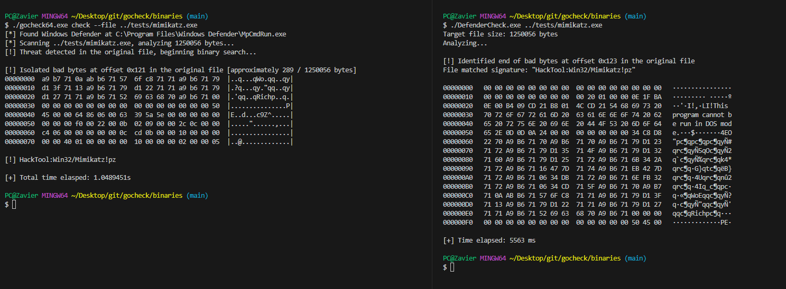

# GoCheck
GoCheck a blazingly fast™ alternative to Matterpreter's [DefenderCheck](https://github.com/matterpreter/DefenderCheck) which identifies the exact bytes that Windows Defender AV by feeding byte slices to `MpCmdRun.exe`

I also wrote a blog post showcasing this project: [Identifying Malicious Bytes in Malware](https://gatari.dev/posts/identifying-malicious-bytes-in-malware/)


## Installation
You can install `gocheck` from `go install`
```bash
go install github.com/gatariee/gocheck@latest
```

Alternatively, you can download the precompiled binaries from the [releases](https://github.com/gatariee/gocheck/releases) or build it yourself.
```bash
git clone https://github.com/gatariee/gocheck
make [ windows / win64 / win32 ]
```

## Usage
```cmd
$ gocheck check --help
Usage:
  gocheck check [path_to_bin] /optional [flags]

Flags:
  -a, --amsi        Use AMSI to scan the binary
  -D, --debug       Enable debug mode
  -d, --defender    Use Windows Defender to scan the binary
  -h, --help        help for check

  [!] UNSTABLE
  -k, --kaspersky   Use Kaspersky's AV Engine to scan the binary
```

## Quick Use
The `check` cobra flag is only used for ease of extensibility in the event that I finally decide to integrate [Ghidra's Headless Analyzer](https://static.grumpycoder.net/pixel/support/analyzeHeadlessREADME.html) with `gocheck`. For ease of use, you can actually completely omit the `check` flag and directly pass the file to `gocheck` as an argument.

```cmd
$ gocheck <file> /optional:args
```

> This may be changed in the future.

## Windows Defender
Real-time protection is optional when scanning using Windows Defender. If real-time protection is enabled, the file may be nuked on first scan. In order to prevent the file from being nuked on first scan, you can set an exclusion for the original file in Windows Defender as `gocheck` creates temporary copies and chucks them into C:\Temp.
```cmd
gocheck [path_to_binary] /optional: --defender
```


## AMSI
When scanning using AMSI, do ensure that real-time protection is enabled. However, at first your file may be nuked.
```cmd
gocheck [path_to_file] /optional: --amsi
```


In order to prevent the file from being nuked on first scan, you can set an exclusion for the original file in Windows Defender as `gocheck` creates temporary copies and chucks them into C:\Temp.
```ps
Add-MpPreference -ExclusionPath [path_to_folder]
```


## External Scanners
There is currently only support for [Kaspersky](https://www.kaspersky.com/security-cloud)'s Security Cloud AV Engine. The `--kaspersky` flag can be used to scan the binary using Kaspersky's AV Engine.

There **are** plans to integrate more AV engines in the future.

> It is normal for Kaspersky's AV engine to take a little longer than Windows Defender to scan the binary.
```cmd
gocheck [path_to_file] /optional: --kaspersky
```


## Concurrency
`gocheck` allows you to scan a binary using multiple AV engines simultaneously. This is done by passing multiple flags to `gocheck`. 

For example, to scan a binary using both **Windows Defender** and **Kaspersky's AV Engine**, you can pass the following flags to `gocheck` & the results will be returned at runtime.
```cmd
gocheck [path_to_file] /optional: --defender --kaspersky
```


## Debug
Gocheck is in heavy WIP and may not work as expected. If you encounter any issues, please run the tool with `--debug` to provide more information about the issue. The `--debug` flag prints out which portions of the binary are being scanned, as well as sanity checks to ensure that the signatured portions are being correctly scanned. 
```cmd
gocheck [path_to_file] /optional: --debug
```


## Common Pitfalls
1. You may need to set exclusions when using `gocheck` to prevent the file from being nuked on first scan, here's how `gocheck` works under the hood:
    * `gocheck` first passes the original file to `MpCmdRun.exe` to scan the file using Windows Defender -> (e.g ./mimikatz.exe)
    * If the scan comes back malicious, we create a folder in the **current working directory** with the respective name of the scanner (e.g `windef`).
    * Then, we start splitting the file (with reference to the original file), and writing the split bytes to the respective folder (e.g `windef`).

      > There are multiple exclusions you need to set, or you can exclude the entire folder where `gocheck` is located.
  
2. Where possible, we try to pass in flags that are not destructive such as `-DisableRemediation` for Windows Defender and `/i0` for Kaspersky's AV Engine. However, whether the file gets sent to the cloud for further analysis **is not** within our control.
    * It is ultimately the responsibility of the operator to assume that the AV engine **will** try it's best to send all binaries to the cloud for further analysis; and to take the necessary precautions to prevent this from happening such as disabling internet access.


## Benchmark
> ⚠️ I am not an expert in benchmarking, and the following benchmarks are conducted on a single machine, and the results may vary on different machines. The benchmarks are conducted on a single machine to provide a rough estimate of the performance difference between `gocheck` and `DefenderCheck`.

The objective of `gocheck` was to implement a faster alternative to Matterpreter's [DefenderCheck](https://github.com/matterpreter/DefenderCheck) as I realized that it was painfully slow when scanning large binaries, which can be quite a headache for extremely large binaries such as those written in Golang.

The following benchmarks were conducted on the following specifications:
* **OS**: Windows 10 Pro
* **CPU**: AMD Ryzen™ 5 3600X
* **RAM**: 32 GB DDR4 3200 MHz

The I/O operations were conducted on a Samsung 870 EVO SATA 2.5" SSD (1 TB), 560/530 MB/s R/W, the temporary binaries are stored in the `C:\Temp` directory.

The version of `gocheck` used in the benchmark is [`v0.1.0`](https://github.com/gatariee/gocheck/releases/download/v1.3.0/gocheck64.exe) and the version of `DefenderCheck` used was the commit [`27616de`](https://github.com/matterpreter/DefenderCheck/commit/27616dea8d27a9d926f5b2178b114109f482c60b) (Sep 15, 2023).

### mimikatz.exe (1,250,056 bytes / 1.19 MB)

| Tool | Time |
|------|------|
| GoCheck | 1.05s |
| DefenderCheck | 5.56s |



### Sliver HTTP Beacon (10,972,160 bytes / 10.4 MB)

| Tool | Time |
|------|------|
| GoCheck | 5.65s |
| DefenderCheck | 35.69s |


## Credits / References
* Originally implemented by [Matterpreter](https://github.com/matterpreter) in [DefenderCheck](https://github.com/matterpreter/DefenderCheck)
* https://github.com/rasta-mouse/ThreatCheck
